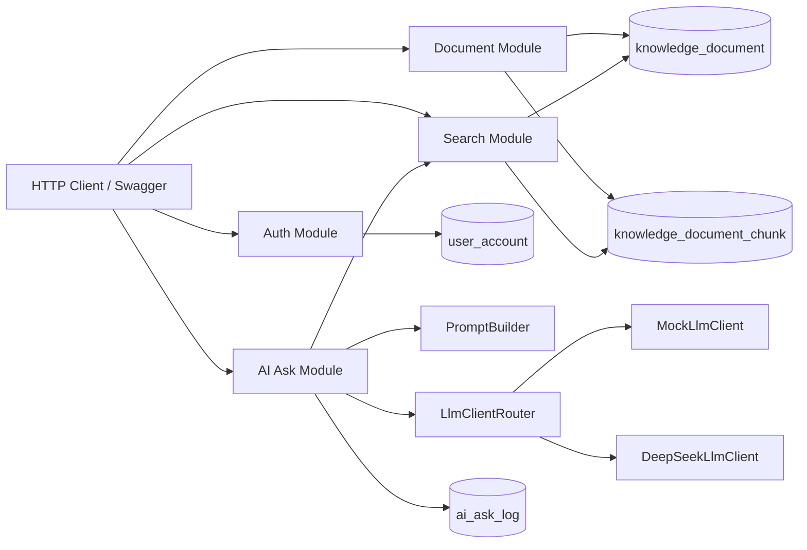

# DevMind Backend

DevMind is a Spring Boot backend for a personal developer knowledge base with a RAG-style question-answering pipeline. It is designed as a Java backend portfolio project: authentication, document management, chunk generation, retrieval, prompt building, model-provider abstraction, citations, and ask logs are implemented as normal backend modules rather than a thin AI demo.

## Features

- JWT authentication with BCrypt password hashing
- User-scoped knowledge documents
- Soft archive instead of physical deletion
- Automatic document chunk generation and rebuild on update
- Keyword-based chunk retrieval v0
- RAG ask flow: question -> retrieval -> prompt -> LLM client -> answer
- Prompt preview and citation metadata
- AI ask logs with token usage for observability, cost tracking, and bad-case analysis
- AI ask feedback for helpfulness labels and bad-case collection
- Pluggable LLM layer with `MockLlmClient` and `DeepSeekLlmClient`
- OpenAPI / Swagger UI
- IDEA HTTP Client test file

## Tech Stack

- Java 17
- Spring Boot 3.3.x
- Spring Security
- MyBatis-Plus
- MySQL
- Redis configuration ready
- Maven
- Springdoc OpenAPI
- JJWT

## Architecture



More details: [Architecture](docs/architecture.md)

## Main Flow

```text
Register/Login
-> Create knowledge document
-> Generate document chunks
-> Retrieve relevant chunks by keyword
-> Build prompt from question and retrieved chunks
-> Generate answer through LlmClient
-> Return citations
-> Save ask log with latency and token usage
```

## API

OpenAPI UI:

```text
http://localhost:8081/swagger-ui.html
```

IDEA HTTP Client:

```text
docs/api/devmind-api.http
```

Current endpoints:

```text
POST   /api/v1/auth/register
POST   /api/v1/auth/login
GET    /api/v1/auth/me
POST   /api/v1/auth/logout

POST   /api/v1/documents
GET    /api/v1/documents
GET    /api/v1/documents/{documentId}
PUT    /api/v1/documents/{documentId}
DELETE /api/v1/documents/{documentId}
GET    /api/v1/documents/{documentId}/chunks

GET    /api/v1/search/chunks?keyword=Redis&limit=5

POST   /api/v1/ai/ask
GET    /api/v1/ai/ask-logs
POST   /api/v1/ai/ask-logs/{logId}/feedback
GET    /api/v1/ai/ask-feedback
```

## Local Setup

Requirements:

- JDK 17+
- Maven 3.8+
- MySQL 5.7+/8.0+
- IntelliJ IDEA 2024.1.2 or compatible

Create database and tables:

```sql
SOURCE src/main/resources/db/schema.sql;
```

For existing databases that were created before later migrations, run files under:

```text
docs/sql/
```

Default app port:

```text
8081
```

Default database:

```text
devmind
```

## Environment Variables

Minimal local MySQL configuration:

```text
DEVMIND_DB_URL=jdbc:mysql://localhost:3306/devmind?useUnicode=true&characterEncoding=utf8&useSSL=false&serverTimezone=Asia/Shanghai&allowPublicKeyRetrieval=true
DEVMIND_DB_USERNAME=your_mysql_username
DEVMIND_DB_PASSWORD=your_mysql_password
DEVMIND_AI_PROVIDER=mock
```

DeepSeek provider:

```text
DEVMIND_AI_PROVIDER=deepseek
DEVMIND_DEEPSEEK_API_KEY=your_api_key
DEVMIND_DEEPSEEK_BASE_URL=https://api.deepseek.com
DEVMIND_DEEPSEEK_MODEL=deepseek-v4-flash
DEVMIND_DEEPSEEK_TEMPERATURE=0.2
```

Do not commit real API keys.

## LLM Provider Design

The AI ask flow depends on the `LlmClient` abstraction:

```text
AiAskService -> LlmClientRouter -> LlmClient
```

Current implementations:

- `MockLlmClient`: local deterministic response for development and testing
- `DeepSeekLlmClient`: OpenAI-compatible DeepSeek chat completions client

This keeps business orchestration separate from model-provider code.

## Observability

Each AI ask request records:

```text
question
retrieval keyword
prompt preview
model provider
mock or real-provider flag
retrieved chunk ids
elapsed milliseconds
prompt tokens
completion tokens
total tokens
feedback labels and bad-case reasons
```

Token fields are populated when the upstream LLM provider returns usage metadata. Mock responses keep them empty.

Feedback records let users mark an answer as helpful or not helpful and add a reason plus an expected answer. This creates a simple bad-case dataset for later retrieval tuning, prompt iteration, and evaluation.

## Learning Notes

Chinese learning notes are maintained while building the project:

```text
docs/learning/devmind-live-notes-cn.md
```

Resume-oriented project description:

```text
docs/resume-cn.md
```

## Project Isolation

This project is isolated from the Sky Take Out project:

```text
DevMind:      F:\AI项目\devmind-backend
Sky Take Out: F:\cangqiong
```

Do not put DevMind files inside `F:\cangqiong`.
