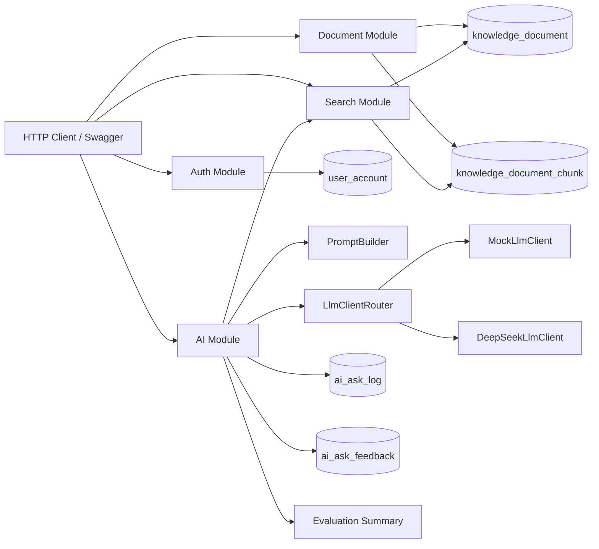
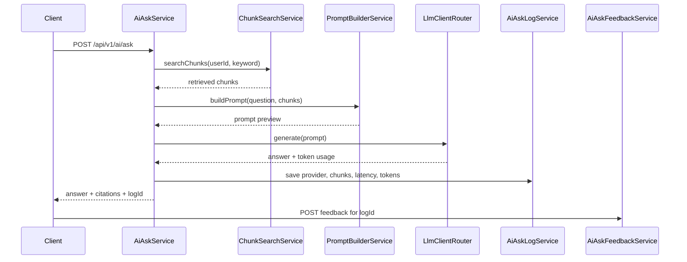

# DevMind Backend

DevMind is a Spring Boot backend for a personal developer knowledge base with a RAG-style AI question-answering pipeline.

It is built as a Java backend portfolio project, not a thin AI API wrapper. The project includes authentication, document management, chunk generation, retrieval, prompt building, LLM provider abstraction, citations, AI call logs, token usage tracking, bad-case feedback, and a lightweight RAG evaluation summary API.

## Why This Project

Many AI demos stop at "send a prompt to a model and return an answer". DevMind treats AI Q&A as part of a normal backend system:

```text
knowledge document
-> document chunks
-> retrieval
-> prompt building
-> LLM provider
-> answer with citations
-> ask log with token usage
-> bad-case feedback
-> evaluation summary
```

This makes the project easier to explain in Java backend interviews because the AI feature is connected to familiar backend concerns: authentication, database design, service layering, observability, cost tracking, and iterative quality improvement.

## Core Features

- JWT authentication with BCrypt password hashing
- User-scoped knowledge documents
- Soft archive instead of physical deletion
- Automatic document chunk generation and rebuild on update
- Keyword-based retrieval v0 for explainable debugging
- RAG ask flow with prompt preview and citations
- Pluggable LLM layer with `MockLlmClient` and `DeepSeekLlmClient`
- DeepSeek real-model integration through environment variables
- AI ask logs with provider, latency, retrieved chunk ids, and token usage
- AI feedback records for helpful labels and bad-case collection
- Evaluation summary API for total feedback, bad-case count, bad-case rate, and recent bad cases
- OpenAPI / Swagger UI and IDEA HTTP Client examples

## Tech Stack

```text
Java 17
Spring Boot 3.3.x
Spring Security
MyBatis-Plus
MySQL
Redis configuration ready
Maven
Springdoc OpenAPI
JJWT
DeepSeek API
```

## Architecture



More details: [Architecture](docs/architecture.md)

## RAG Flow



## API Overview

Swagger UI:

```text
http://localhost:8081/swagger-ui.html
```

IDEA HTTP Client examples:

```text
docs/api/devmind-api.http
```

Main endpoints:

```text
POST   /api/v1/auth/register
POST   /api/v1/auth/login
GET    /api/v1/auth/me
POST   /api/v1/auth/logout

POST   /api/v1/documents
GET    /api/v1/documents
GET    /api/v1/documents/{documentId}
PUT    /api/v1/documents/{documentId}
DELETE /api/v1/documents/{documentId}
GET    /api/v1/documents/{documentId}/chunks

GET    /api/v1/search/chunks

POST   /api/v1/ai/ask
GET    /api/v1/ai/ask-logs
POST   /api/v1/ai/ask-logs/{logId}/feedback
GET    /api/v1/ai/ask-feedback
GET    /api/v1/ai/evaluation/summary
```

## Observability And Evaluation

Each AI ask log records:

```text
question
retrieval keyword
prompt preview
model provider
mock or real-provider flag
retrieved chunk ids
elapsed milliseconds
prompt tokens
completion tokens
total tokens
```

Feedback records store:

```text
helpful label
bad-case reason
expected answer
related ask log id
```

The evaluation summary API aggregates:

```text
total feedback count
helpful count
bad-case count
bad-case rate
recent bad cases
```

## Local Setup

Requirements:

- JDK 17+
- Maven 3.8+
- MySQL 5.7+/8.0+
- IntelliJ IDEA 2024.1.2 or compatible

Create database and tables:

```sql
SOURCE src/main/resources/db/schema.sql;
```

For an existing local database, run migration files under:

```text
docs/sql/
```

Default app port:

```text
8081
```

Default database:

```text
devmind
```

## Environment Variables

Minimal local configuration:

```text
DEVMIND_DB_URL=jdbc:mysql://localhost:3306/devmind?useUnicode=true&characterEncoding=utf8&useSSL=false&serverTimezone=Asia/Shanghai&allowPublicKeyRetrieval=true
DEVMIND_DB_USERNAME=your_mysql_username
DEVMIND_DB_PASSWORD=your_mysql_password
DEVMIND_JWT_SECRET=replace_with_a_long_random_secret_for_non_local_use
DEVMIND_AI_PROVIDER=mock
```

DeepSeek provider:

```text
DEVMIND_AI_PROVIDER=deepseek
DEVMIND_DEEPSEEK_API_KEY=your_api_key
DEVMIND_DEEPSEEK_BASE_URL=https://api.deepseek.com
DEVMIND_DEEPSEEK_MODEL=deepseek-v4-flash
DEVMIND_DEEPSEEK_TEMPERATURE=0.2
```

Never commit real API keys.

The default JWT secret in `application.yml` is only for local development. Override `DEVMIND_JWT_SECRET` in any shared, deployed, or production-like environment.

## Interview Notes

Chinese interview-oriented notes:

```text
docs/interview-guide-cn.md
docs/resume-cn.md
docs/learning/devmind-live-notes-cn.md
```
