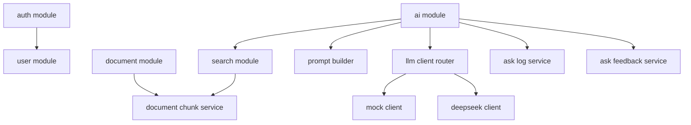
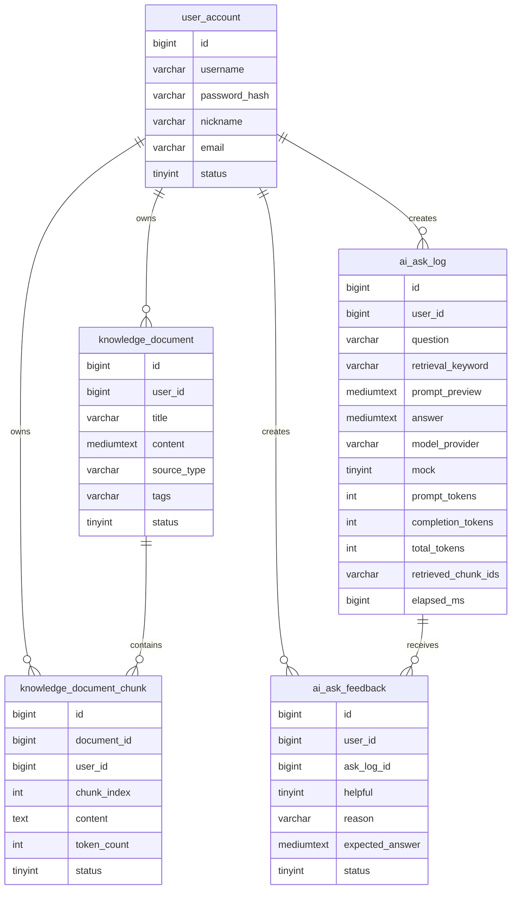
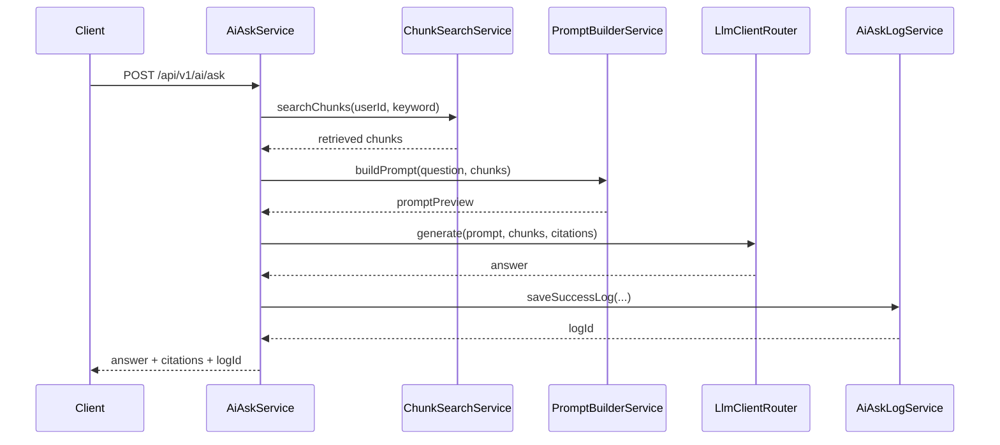

# DevMind Architecture

## Goal

DevMind is a Java backend project for a personal developer knowledge base. The system stores learning notes and project reviews, turns long documents into chunks, retrieves relevant chunks, builds a RAG prompt, and routes the final answer generation through a pluggable LLM client.

## Module Overview

## Data Model

## RAG Flow

## Design Choices

- Soft archive is used for documents and chunks to preserve history.
- Chunks are rebuilt after document updates to keep retrieval results aligned with the latest content.
- Retrieval v0 uses keyword matching first, because it is easy to debug before introducing embeddings.
- `LlmClient` separates model-provider implementation from RAG orchestration.
- Ask logs record question, retrieval keyword, chunk ids, answer, provider, token usage, and elapsed time for later bad-case analysis.
- Ask feedback stores helpfulness labels, reasons, and expected answers so bad cases can become a small evaluation dataset.

## Next Improvements

- Add DeepSeek real-call smoke test with environment-only API key.
- Add embedding and vector retrieval.
- Add hybrid retrieval: keyword + vector.
- Add reranking.
- Use feedback labels to build retrieval evaluation and bad-case reports.
- Add Flyway for database migration management.
